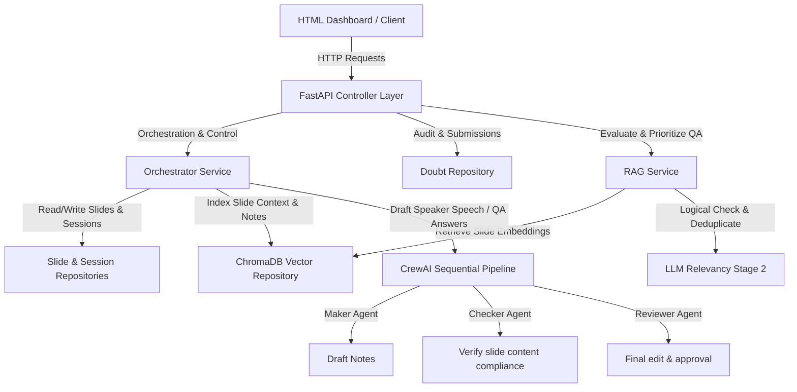

# AI Seminar System

An advanced AI-powered Interactive Seminar & Presentation QA Assistant. Built with **FastAPI**, **CrewAI**, **ChromaDB**, and **Pydantic**, this system orchestrates real-time presentation flow, indexes slide decks dynamically for semantic search, and ranks audience doubts using a high-quality **Two-Stage RAG and LLM Pipeline**.

---

## 🚀 Key Features

* **Dynamic Slide Deck Indexing (RAG)**: Automatically processes slide decks, splits content, computes vector embeddings using `sentence-transformers`, and indexes them in a local **ChromaDB** vector database. Contains a keyword-matching search fallback if embeddings cannot be computed locally.
* **Two-Stage LLM Doubt Relevancy & Deduplication**:
  * **Stage 1 (Vector Pruning)**: Filters out questions with similarity scores $< 0.35$ and narrows candidate lists down to the top 10 most relevant questions.
  * **Stage 2 (LLM Logic & Deduplication)**: Sends candidates to Gemini/OpenAI to evaluate true contextual relevance (ignoring keyword false-positives), group duplicate questions, and assign a priority score ($1$-$10$).
* **CrewAI Multi-Agent Pipeline**: Coordinating **Maker**, **Checker**, and **Reviewer** agents in a sequential workflow to automatically draft and format slide-specific scripts or QA answers. Features a robust mock fallback for development without API keys.
* **Interactive Glassmorphism Dashboard**: Real-time web panel featuring smooth slide transitions, current speaker notes display, automated doubts list updating, and control buttons to advance/rewind slides.
* **Postman Collection**: Features a preconfigured Postman collection (`ai_seminar_system_postman_collection.json`) with all REST API routes and paths variables mapped.
* **Robust Verification & Testing**: Comprehensive unit tests covering database operations, RAG pipelines, api endpoints, and agents logic.

---

## 📐 System Architecture

The AI Seminar System adopts a clean architectural design combining the Repository Pattern and Layered Services:



---

## 📂 Project Structure

```text
ai_seminar_system/
├── app/
│   ├── __init__.py
│   ├── main.py                     # Entry point for FastAPI & Dashboard UI
│   ├── core/
│   │   ├── __init__.py
│   │   └── config.py               # Application settings & LLM configuration
│   ├── models/                     # Pydantic Schemas & Domain Entities
│   │   ├── __init__.py
│   │   ├── session.py              # Seminar state structures
│   │   ├── slide.py                # Slide metadata and contents
│   │   └── doubt.py                # Student doubt state and classification
│   ├── repositories/               # Repository Data Access Layer
│   │   ├── __init__.py
│   │   ├── base.py                 # Abstract base repository interfaces
│   │   ├── slide_repository.py     # Slide deck CRUD operations
│   │   ├── session_repository.py   # Active seminar state CRUD
│   │   ├── doubt_repository.py     # Student doubts CRUD
│   │   └── vector_repository.py    # Vector Store (ChromaDB + Fallbacks)
│   ├── services/
│   │   ├── __init__.py
│   │   └── rag_service.py          # RAG vector retrieval & Two-stage ranking
│   └── agents/                     # Multi-Agent workflows (CrewAI)
│       ├── __init__.py
│       ├── crew.py                 # Crew orchestration & fallback agents
│       └── orchestrator.py         # App manager linking agents, slides & doubts
├── tests/                          # Automated unit test suite
│   ├── __init__.py
│   └── test_api.py
├── .gitignore
├── requirements.txt                # Project dependencies
├── reset_db.py                     # Utility to clear & seed the database
├── inspect_db.py                   # Prints ChromaDB collection contents
├── run.py                          # Startup script running Uvicorn server
└── ai_seminar_system_postman_collection.json # API schema collection
```

---

## ⚙️ Installation & Setup

### 1. Prerequisites
Ensure you have **Python 3.10+** and **Git** installed on your system.

### 2. Clone the Repository & Configure Workspace
```powershell
git clone https://github.com/ritujaryan/ai-seminar.git
cd ai-seminar
```

### 3. Create a Virtual Environment & Install Dependencies
Create and activate your Python virtual environment, then install requirements:
```powershell
# Create Virtual Environment
python -m venv venv

# Activate Virtual Environment (Windows PowerShell)
.\venv\Scripts\activate

# Install Dependencies
pip install -r requirements.txt
```

### 4. Configuration Settings (`.env`)
Create a `.env` file in the root of the project to set up your LLM configuration:
```env
# Server Port Configuration
PORT=8000

# LLM Providers Configuration ("gemini", "openai", or "mock")
# If "mock" is used (default), standard mock responses will run without API keys.
LLM_PROVIDER=mock

# LLM API Keys (Required if using gemini or openai)
GEMINI_API_KEY=your_gemini_api_key_here
OPENAI_API_KEY=your_openai_api_key_here
```

---

## 🛠️ Running the Application

### 1. Clear and Seed the Database
Run the helper script to clear existing records and seed a default 4-slide presentation deck ("Building Production-Grade RAG Systems") and 4 sample audience doubts:
```powershell
python reset_db.py
```

### 2. Inspect Local ChromaDB Collections
To review slide notes, embeddings, and QA items indexed in ChromaDB:
```powershell
python inspect_db.py
```

### 3. Run the Backend & Frontend Web Application
Start the Uvicorn FastAPI server:
```powershell
python run.py
```
Open your browser and navigate to **`http://localhost:8000/`** to interact with the glassmorphic presentation dashboard.

---

## 🧪 Testing

The repository includes a comprehensive unit test suite targeting all controllers, schemas, repositories, and RAG classification boundaries. Run tests via `pytest`:
```powershell
pytest
```

---

## 🔌 API Endpoints Summary

### Slides
* `GET /api/v1/slides/` - List all slides in the deck.
* `GET /api/v1/slides/{slide_id}` - Retrieve a slide by its ID.

### Student Doubts
* `POST /api/v1/doubts/` - Submit a new audience doubt.
* `GET /api/v1/doubts/` - List all doubts.
* `POST /api/v1/doubts/{doubt_id}/vote` - Upvote a doubt (increases priority).
* `POST /api/v1/doubts/{doubt_id}/resolve` - Mark doubt as resolved.
* `POST /api/v1/doubts/{doubt_id}/archive` - Move doubt to archives.
* `GET /api/v1/doubts/slide/{slide_id}/rank` - Run the **Two-Stage RAG Pipeline** to retrieve ranked doubts sorted by relevance to the specific slide.

### Seminar Session
* `GET /api/v1/seminar/state` - Fetch current seminar state (current slide, active doubt, active script).
* `POST /api/v1/seminar/next` - Advance to next slide and generate speaker notes speech.
* `POST /api/v1/seminar/prev` - Rewind to previous slide and generate speech.
* `POST /api/v1/seminar/answer-doubt` - Run CrewAI agents to draft an answer to the current active doubt.

---

## 🛡️ Robust Failbacks
This project is engineered to work reliably under multiple constraints:
1. **Mock API Fallback**: If LLM API keys are invalid or missing, the system activates simulated CrewAI agents and GPT models to return high-fidelity responses, preventing app failures.
2. **Vector DB Fallback**: If ChromaDB cannot load libraries or embeddings models, a fallback keyword-matching engine is used to maintain basic search functionality.
